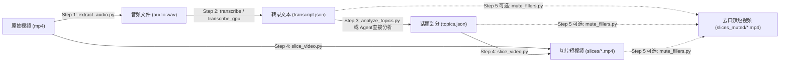

# Video Slice Skill (长视频智能话题切片)

将录播、直播回放、访谈等长视频，按照话题或知识点自动切片，生成适合短视频平台（B站、抖音、小红书、视频号等）发布的短视频片段。本 Skill 将所有相关脚本与工具统一收拢到 `scripts/` 目录下，提供独立的单步执行脚本以及一键串联的流水线脚本。

---

## 目录结构

```
videos/skills/video-slice/
├── skill.md                  # 技能说明文档
├── SKILL.md                  # 规范化技能入口（与 skill.md 同步）
├── requirements.txt          # Python 依赖清单
└── scripts/                  # 核心脚本集合目录
    ├── extract_audio.py      # Step 1: 从长视频提取 16kHz 单声道 WAV 音频
    ├── transcribe.py         # Step 2: 本地 Whisper 语音转写（词级时间戳）
    ├── transcribe_gpu.py     # Step 2(备选): 分块 GPU 加速转录（防长音频幻觉）
    ├── run_on_gpu.py         # Step 2(辅助): 远程 GPU 机器一键转写引导
    ├── analyze_topics.py     # Step 3: LLM 智能话题分段与时间边界对齐
    ├── slice_video.py        # Step 4: 基于 ffmpeg 导出高质量独立切片视频
    ├── mute_fillers.py       # Step 5(可选): 根据词级时间戳自动静音口癖/语气词
    └── pipeline.py           # 一键流水线：端到端执行全部或指定步骤
```

---

## 依赖与环境准备

### 1. 系统工具依赖
- **ffmpeg** 和 **ffprobe**：必须安装且已配置在系统 `PATH` 环境变量中。

### 2. Python 依赖
```bash
pip install -r requirements.txt
```
主要依赖包：
- `openai-whisper`：用于高精度语音识别与词级时间戳生成。
- `torch`：PyTorch（GPU 机器建议安装 CUDA 对应版本，如 `pip install torch --index-url https://download.pytorch.org/whl/cu124`）。
- `anthropic`：用于调用大模型进行话题边界分析（支持千帆、DeepSeek 等兼容接口）。

---

## 工作流程概述



---

## 步骤详解与使用方法

### 方式一：使用统一流水线 (推荐)

可以通过 `pipeline.py` 一键自动运行完整流程或特定步骤：

```bash
# 完整全自动执行（步骤 1 → 2 → 3 → 4）
python scripts/pipeline.py -v "path/to/video.mp4" -w "path/to/output_dir"

# 可选带 Step 5（自动静音语气词/口癖）
python scripts/pipeline.py -v "path/to/video.mp4" -w "path/to/output_dir" --mute-fillers

# 单独执行指定步骤（例如只执行切片 Step 4）
python scripts/pipeline.py -v "path/to/video.mp4" -w "path/to/output_dir" --step 4
```

---

### 方式二：分步独立执行

#### Step 1: 提取音频 (`extract_audio.py`)

将长视频转换为 Whisper 最佳识别格式（16kHz、单声道、16-bit PCM WAV）。

```bash
# 基本用法
python scripts/extract_audio.py "视频路径.mp4" "输出音频.wav"

# 参数方式
python scripts/extract_audio.py -i "video.mp4" -o "audio.wav"
```
- **输出**: `audio.wav`
- **特点**: 若目标文件已存在会自动跳过，添加 `--force` 可强制覆盖。

---

#### Step 2: Whisper 语音转录

##### 本地有 GPU 或短视频测试 (`transcribe.py`)
```bash
python scripts/transcribe.py -a "audio.wav" -o "transcript.json" --model medium --language zh
```
- 支持模型: `tiny`, `base`, `small`, `medium`, `large-v3-turbo`（中文推荐 `medium` 或 `large-v3-turbo`）。
- 输出: 包含每个句子及逐词精确时间戳的 `transcript.json`。

##### 长音频 / 显存有限 / 避免幻觉 (`transcribe_gpu.py`)
对于超过 30 分钟的长音频，直接单次输入容易产生重复死循环（Whisper Hallucination），使用分块转写：
```bash
python scripts/transcribe_gpu.py -a "audio.wav" -o "transcript.json" --model medium --chunk 300
```
- `--chunk 300`: 将音频按 300 秒（5分钟）切块分别识别，并自动累加时间偏移合成完整时间戳。

##### 跨机器执行说明 (本地无 GPU 时)
1. 在本机执行 Step 1 得到 `audio.wav`。
2. 将 `audio.wav` 与 `scripts/run_on_gpu.py`、`scripts/transcribe_gpu.py`（或 `transcribe.py`）拷贝至远程 GPU 服务器同一目录下。
3. 在 GPU 服务器上执行：
   ```bash
   pip install openai-whisper torch
   python run_on_gpu.py
   ```
4. 执行完成后将生成的 `transcript.json` 拷贝回本机工作目录。

---

#### Step 3: 话题分析 (`analyze_topics.py`)

##### 方式 A（推荐）：由 Claude / Agent 助手直接分析
如果正在与 AI 编程助手交互，直接将 `transcript.json` 的文本传给助手，让助手按照下面的 JSON Schema 直接生成 `topics.json`，无需额外配置 API Key：

```json
{
  "topics": [
    {
      "index": 1,
      "title": "话题标题（10字以内）",
      "start_time": 0.0,
      "end_time": 123.5,
      "summary": "一句话核心内容概括"
    }
  ]
}
```

##### 方式 B：调用 LLM API 自动分析 (`analyze_topics.py`)
```bash
python scripts/analyze_topics.py \
  -t "transcript.json" \
  -o "topics.json" \
  --api-key "YOUR_KEY" \
  --base-url "https://qianfan.baidubce.com/anthropic/coding" \
  --model "deepseek-v4-pro"
```
- 环境变量支持: `ANTHROPIC_AUTH_TOKEN`, `ANTHROPIC_BASE_URL`, `TOPIC_ANALYSIS_MODEL`
- 具备长文本自动分块、速率限制指数退避重试与中断续传能力。

---

#### Step 4: ffmpeg 切片生成 (`slice_video.py`)

依据 `topics.json` 中的时间戳与标题，自动切分视频并生成规整命名的 MP4 短视频：

```bash
# 默认精确重编码模式（画面音画同步极佳，推荐）
python scripts/slice_video.py -i "video.mp4" -t "topics.json" -o "./slices"

# 快速流拷贝模式（极速不耗 CPU，按最近关键帧切分）
python scripts/slice_video.py -i "video.mp4" -t "topics.json" -o "./slices" --copy
```
- **输出格式**: `01_话题标题1.mp4`, `02_话题标题2.mp4`...
- 自动清理 Windows/Linux 文件名非法字符。

---

#### Step 5 (可选): 口癖/语气词静音过滤 (`mute_fillers.py`)

短视频观众对“嗯、啊、呃、这个、然后”等停顿非常敏感。本脚本利用 Step 2 生成的词级时间戳，自动定位切片中的纯停顿语气词，并通过 ffmpeg 音量曲线将其静音，同时完整保留原画轨：

```bash
python scripts/mute_fillers.py \
  -t "transcript.json" \
  -p "topics.json" \
  -s "./slices" \
  -o "./slices_muted"
```
- 仅对无实际意义的语气词/连词停顿段落进行精准降噪静音，不影响正常语速与画面流畅度。

---

## 典型输出文件清单

每次处理一个长视频后，标准产物目录如下：

```
work_dir/
├── audio.wav                 # Step 1 提取的高品质单声道音频
├── transcript.json           # Step 2 生成的逐句与词级转录时间戳
├── topics.json               # Step 3 生成的结构化话题段落
├── slices/                   # Step 4 生成的各个短视频片段
│   ├── 01_项目背景介绍.mp4
│   ├── 02_核心架构拆解.mp4
│   └── 03_踩坑与调优建议.mp4
└── slices_muted/             # (可选) Step 5 消除语气词后的短视频片段
    ├── 01_项目背景介绍.mp4
    └── ...
```
